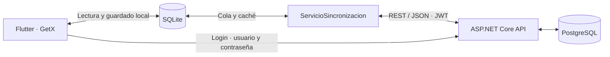

# Gestión móvil de incidencias técnicas

MVP para reportar y atender incidencias en sucursales. Resuelve la pérdida de continuidad cuando un técnico trabaja temporalmente sin Internet: la interfaz consulta y guarda en SQLite, y después sincroniza con la API.

## Arquitectura y tecnologías



Flutter/Dart utiliza MVC simplificado, GetX, sqflite, HTTP, flutter_secure_storage, connectivity_plus, image_picker e image. La API usa C#/.NET 10, controllers, DTOs, servicios, acceso parametrizado con Npgsql y JWT. SQLite contiene identidad pública y trabajo local; el JWT se guarda en el almacén seguro. La API no instala esquema ni datos.

```text
mobile/       Aplicación Flutter, pruebas y proyectos nativos
api/          API REST: Controllers, DTOs, Models, Data y Services
tests/api/    Comprobaciones de API; modo real optativo
database/
  PostgreSQL/v1/    Motor probado
  SQLServer/v1/    Equivalencia documental
docs/         Agenda, evidencias, decisiones y guion del video
```

## Requisitos e instalación de la base

Se utilizaron Flutter 3.41.9 / Dart 3.11.5, SDK Android, .NET SDK 10 y PostgreSQL 17. Para la app física se necesita un teléfono Android conectado por USB y con acceso a la API.

**PostgreSQL probado:** crear una base vacía `tickets_db` y conectar pgAdmin Query Tool a ella. Copiar y ejecutar [database/PostgreSQL/v1/BD_COMPLETA.sql](database/PostgreSQL/v1/BD_COMPLETA.sql). Alternativamente:

```sh
psql -v ON_ERROR_STOP=1 -d tickets_db -f database/PostgreSQL/v1/BD_COMPLETA.sql
```

Proporcionar la conexión de psql mediante la configuración local. El instalador es autocontenido; no requiere migraciones anteriores y no debe ejecutarse para actualizar una base existente. Se verificó desde cero en una base temporal independiente, luego eliminada, conservando la base de trabajo.

**SQL Server equivalente documental:** crear y seleccionar una base vacía en SSMS y ejecutar [database/SQLServer/v1/BD_COMPLETA.sql](database/SQLServer/v1/BD_COMPLETA.sql). No se ejecutó contra una instancia real; la API actual utiliza PostgreSQL.

Cada motor tiene `DATABASE.sql`, `DATOS_PRUEBA.sql`, `STORED_PROCEDURES.sql`, `VISTAS.sql`, `TRIGGERS.sql` y `BD_COMPLETA.sql`. El completo concatena las otras cinco fuentes en orden de dependencias. Incluye ocho tablas, función/SP de usuario activo, vista `agenda_tickets` y datos demo; no requiere extensiones ni triggers.

## Configurar y ejecutar la API

Desde la raíz, guardar las credenciales exclusivamente en User Secrets. Los valores siguientes son placeholders, no credenciales utilizables:

```sh
dotnet user-secrets set "ConnectionStrings:DefaultConnection" "Host=localhost;Port=5432;Database=tickets_db;Username=TU_USUARIO;Password=TU_PASSWORD" --project api
dotnet user-secrets set "Jwt:Key" "TU_CLAVE_ALEATORIA_DE_AL_MENOS_32_BYTES" --project api
dotnet restore api/Tickets.Api.csproj
dotnet run --project api/Tickets.Api.csproj --launch-profile lan
```

El perfil `lan` escucha HTTP en el puerto 5263 para desarrollo. Abrir [Swagger local](http://localhost:5263/swagger). Login y `GET /api/health/database` son anónimos; las operaciones de negocio y `/api/auth/me` requieren JWT. La clave, conexión y JWT completos no se publican en el repositorio ni en respuestas de diagnóstico.

### Ejecución en Linux

Con PostgreSQL y .NET 10 instalados, crear la base con el mismo script. Para una ejecución local de desarrollo, configurar variables fuera del repositorio y publicar:

```sh
export ConnectionStrings__DefaultConnection='Host=localhost;Port=5432;Database=tickets_db;Username=TU_USUARIO;Password=TU_PASSWORD'
export Jwt__Key='TU_CLAVE_ALEATORIA_DE_AL_MENOS_32_BYTES'
export ASPNETCORE_ENVIRONMENT=Development
export ASPNETCORE_URLS='http://0.0.0.0:5263'
dotnet publish api/Tickets.Api.csproj -c Release -o /tmp/tickets-api
dotnet /tmp/tickets-api/Tickets.Api.dll
```

Este modo habilita Swagger/HTTP para demostración. Un despliegue público requiere configurar HTTPS y operación del servicio; esos elementos no están implementados. No se realizó una prueba de despliegue Linux.

## Ejecutar Flutter en el teléfono

Establecer `API_BASE_URL` externamente con la URL que el teléfono pueda alcanzar. API y teléfono deben compartir una red accesible; permitir el puerto 5263 en el firewall del equipo. `localhost` en el teléfono identifica al propio teléfono.

Desde `mobile/`, con la variable configurada:

```powershell
flutter pub get
flutter run -d ID_DISPOSITIVO "--dart-define=API_BASE_URL=$env:API_BASE_URL"
flutter build apk --debug "--dart-define=API_BASE_URL=$env:API_BASE_URL"
adb install -r build/app/outputs/flutter-apk/app-debug.apk
```

En Linux/macOS usar `--dart-define=API_BASE_URL="$API_BASE_URL"`. No se usan emuladores ni `flutter drive` en la revisión física. Instalar por reemplazo conserva los datos; no desinstalar ni borrar almacenamiento. `API_BASE_URL` se fija al compilar y cambiarla requiere recompilar. El fallback heredado corresponde a la dirección especial de Android Emulator: para el dispositivo físico se debe proporcionar siempre la URL real externamente. No hay una IP LAN fija en los archivos de configuración.

## Usuarios DEMO y roles

Credenciales tomadas exclusivamente de [PostgreSQL/v1/DATOS_PRUEBA.sql](database/PostgreSQL/v1/DATOS_PRUEBA.sql), con los mismos hashes en SQL Server. Son públicas de desarrollo; no usarlas en producción. La base almacena únicamente PasswordHash.

| Usuario DEMO | Contraseña DEMO | Rol | Alcance |
|---|---|---|---|
| usuario1 | Demo123* | Usuario | Reporta, ve sus tickets, agrega foto inicial y solicita resolución/cancelación. |
| tecnico1 | Demo123* | Técnico | Consulta únicamente asignados, inicia atención, registra seguimiento/evidencia y solicita cierre/cancelación. |
| coordinador1 | Demo123* | Coordinador | Consulta propios/equipo/sin asignar, programa, asigna y aprueba/rechaza solicitudes. |
| admin1 | AdminDemo123* | Administrador | Acceso global a las operaciones existentes. |

La carga demo contiene una sucursal, tres reportes de usuario1 —dos asignados al Técnico y uno sin asignar—, una relación Coordinador–Técnico, una evidencia descriptiva y siete eventos. Los usuarios quedan activos. Repetir la carga no duplica datos ni sustituye contraseñas existentes.

El Home del Coordinador tiene cuatro cards tipo acordeón: **Mis tickets**, **Técnicos a mi cargo**, **Sin asignar** y **Solicitudes**. Empiezan cerradas y solo una puede permanecer abierta, reduciendo saturación. También puede atender sus propios tickets asignados. El Administrador usa el alcance global de las pantallas existentes; no hay un panel administrativo independiente.

## Flujo de trabajo

1. Usuario crea un reporte con sucursal, problema, descripción y foto opcional; no elige técnico ni fecha de atención.
2. Coordinador lo encuentra en Sin asignar, programa fecha/hora y asigna al Técnico. `ScheduledAt = NULL` significa **Sin programar**.
3. Técnico inicia atención y registra seguimiento con texto, foto o ambos.
4. Usuario o responsable autorizado solicita resolución/cancelación. La cancelación exige motivo; guardar la solicitud no finaliza el ticket.
5. Coordinador/Administrador aprueba o rechaza dentro de su alcance. Aprobar registra la decisión y cambia a **Resolved** o **Cancelled**; rechazar conserva el estado del ticket.

Los estados son Pending, InProgress, Resolved y Cancelled. Programación/asignación pertenecen a Coordinador/Administrador; cierre y cancelación requieren revisión. Los permisos también se comprueban en la API.

## Offline y sincronización automática

**Acción → SQLite → UI inmediata → intento automático de sincronización.** Si falta red o falla la API, el trabajo permanece en la cola. ↻ permite reintentar manualmente; no es necesario pulsarlo para guardar. El envío también se intenta al abrir Home y al recuperar conectividad. Detectar red no garantiza que la API esté disponible.

Cada operación conserva propietario y claves de reintento; los ciclos se ejecutan de forma exclusiva. Los datos remotos se descargan a SQLite sin sobrescribir cambios pendientes. La identidad local permite continuar en Home offline; JWT expirado o un 401 requiere reautenticación para operaciones remotas, sin borrar trabajo. El primer login sí necesita conexión. Cerrar sesión conserva negocio y cola; otra cuenta no procesa pendientes ajenos.

## Evidencias y timeline

La foto es opcional, desde cámara o galería. Se previsualizan los bytes procesados antes de guardar y se puede Cambiar/Quitar. Se aplica orientación, límite inicial de dimensión mayor a 1600 y compresión JPEG progresiva; máximo **1 MiB de bytes comprimidos**, antes de Base64. El contenido completo se guarda en Evidences; los eventos solo mantienen su referencia. No hay almacenamiento cloud.

El timeline muestra fecha original y autor: CREADO, PROGRAMADO, REPROGRAMADO, ASIGNADO, REASIGNADO, EN_ATENCION, SEGUIMIENTO, SOLICITUD_RESOLUCION, SOLICITUD_CANCELACION, RESOLUCION_APROBADA, RESOLUCION_RECHAZADA, CANCELACION_APROBADA, CANCELACION_RECHAZADA, RESUELTO y CANCELADO. La revisión aprobada guarda solicitud, estado final y eventos en una transacción remota. No se inventa historia para registros antiguos.

## Decisiones, límites y mejora posterior

Se priorizó MVC sencillo, SQL parametrizado y una única cola local sobre capas adicionales. UUID estables evitan duplicar acciones al reintentar; la identidad local está separada del JWT para sostener trabajo offline. La dificultad principal fue conservar orden, autoría e idempotencia durante desconexiones, junto con migraciones SQLite que preservaran registros y referencias. Detalle: [arquitectura local-first](docs/arquitectura-local-first.md), [agenda/tickets](docs/tickets-agenda.md), [evidencias](docs/evidencias.md) y [portabilidad](docs/portabilidad-base-datos.md).

Límites reales: no hay resolución automática de conflictos ni sincronización en background con la app cerrada. Una modificación puede permanecer pendiente hasta que el servidor acepte sus permisos/estado. Evidencias intencionalmente idénticas pueden compartir registro remoto. No se probaron iOS, SQL Server ni despliegue Linux. El esquema no modela zonas/tenants de coordinación; Sin asignar es un conjunto común. El MVP no ofrece gestión de usuarios, recuperación de contraseña, notificaciones, chat, mapas/GPS, cloud de imágenes, tiempo real ni CI/CD.

Con una semana adicional se priorizarían errores de cola más claros y recuperación guiada, pruebas de desconexión/concurrencia prolongadas, optimización de descarga de fotos y preparación de despliegue HTTPS/Linux. Son propuestas, no funcionalidades implementadas.

Se utilizó IA para implementación, revisión, SQL, pruebas y documentación bajo decisiones y autorizaciones del desarrollador; el flujo físico fue revisado por el usuario.

## Validación y demostración

```sh
dotnet build api/Tickets.Api.csproj
cd mobile
flutter analyze
flutter test
```

La última suite completa aprobó 96 pruebas y omitió dos integraciones optativas que requieren configuración externa. PostgreSQL v1 se instaló desde cero y su catálogo se comparó con el vigente; SQL Server tiene revisión estática. El usuario confirmó la validación funcional física. Las pruebas automatizadas cubren roles, sesión, migraciones, offline, sincronización, evidencias, timeline, solicitudes y Home.

[Guion de video, 2:55](docs/guion-video.md).
