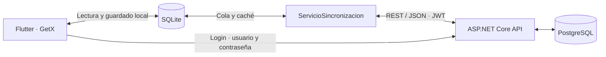

# Gestión móvil de incidencias técnicas

MVP para reportar y atender incidencias en sucursales. Resuelve la pérdida de continuidad cuando un técnico trabaja temporalmente sin Internet: la interfaz consulta y guarda en SQLite, y después sincroniza con la API.

## Arquitectura y tecnologías



Flutter/Dart utiliza MVC simplificado, GetX, sqflite, HTTP, flutter_secure_storage, connectivity_plus, image_picker e image. La API usa C#/.NET 10, controllers, DTOs, servicios, acceso parametrizado con Npgsql y JWT. SQLite contiene identidad pública y trabajo local; el JWT se guarda en el almacén seguro. La API no instala esquema ni datos.

```text
mobile/       Aplicación Flutter, pruebas y proyectos nativos
api/          API REST: Controllers, DTOs, Models, Data y Services
tests/api/    Comprobaciones de API; modo real optativo
database/
  PostgreSQL/v1/    Motor probado
  SQLServer/v1/    Equivalencia documental
docs/         Agenda, evidencias, decisiones y guion del video
```

## Instalación desde cero

Se utilizaron Flutter 3.41.9 / Dart 3.11.5, SDK Android, .NET SDK 10 y PostgreSQL 17. Para la app física se necesita un teléfono Android conectado por USB y con acceso a la API.

### A) Base de datos

**PostgreSQL probado:** crear una base vacía `tickets_db` y conectar pgAdmin Query Tool a ella. Copiar y ejecutar [database/PostgreSQL/v1/BD_COMPLETA.sql](database/PostgreSQL/v1/BD_COMPLETA.sql). Alternativamente:

```sh
psql -v ON_ERROR_STOP=1 -d tickets_db -f database/PostgreSQL/v1/BD_COMPLETA.sql
```

Proporcionar la conexión de psql mediante la configuración local. El instalador es autocontenido; no requiere migraciones anteriores y no debe ejecutarse para actualizar una base existente. Se verificó desde cero en una base temporal independiente, luego eliminada, conservando la base de trabajo.

**SQL Server equivalente documental:** crear y seleccionar una base vacía en SSMS y ejecutar [database/SQLServer/v1/BD_COMPLETA.sql](database/SQLServer/v1/BD_COMPLETA.sql). No se ejecutó contra una instancia real; la API actual utiliza PostgreSQL.

Cada motor tiene `DATABASE.sql`, `DATOS_PRUEBA.sql`, `STORED_PROCEDURES.sql`, `VISTAS.sql`, `TRIGGERS.sql` y `BD_COMPLETA.sql`. El completo concatena las otras cinco fuentes en orden de dependencias. Incluye ocho tablas, función/SP de usuario activo, vista `agenda_tickets` y datos demo; no requiere extensiones ni triggers.

### B) API

Desde la raíz, guardar las credenciales exclusivamente en User Secrets. Los valores siguientes son placeholders, no credenciales utilizables:

```sh
dotnet user-secrets set "ConnectionStrings:DefaultConnection" "Host=localhost;Port=5432;Database=tickets_db;Username=TU_USUARIO;Password=TU_PASSWORD" --project api
dotnet user-secrets set "Jwt:Key" "TU_CLAVE_ALEATORIA_DE_AL_MENOS_32_BYTES" --project api
dotnet restore api/Tickets.Api.csproj
dotnet run --project api/Tickets.Api.csproj --launch-profile lan
```

`ConfiguracionSecretsApi` contiene únicamente los nombres `ClaveConexionBaseDatos` y `ClaveJwt`; nunca contiene sus valores. Se enlaza y valida con Options Pattern al arrancar. La selección no sensible está en `appsettings.json`:

```json
"SecretsApi": {
  "ClaveConexionBaseDatos": "ConnectionStrings:DefaultConnection",
  "ClaveJwt": "Jwt:Key"
}
```

Para seleccionar otras claves, guardar sus valores en User Secrets y cambiar únicamente SecretsApi:ClaveConexionBaseDatos y SecretsApi:ClaveJwt. IdentificadorAlmacenSecrets en Tickets.Api.csproj identifica el almacén de desarrollo. La API valida nombres/valores obligatorios y JWT de al menos 32 caracteres y 32 bytes UTF-8.

El perfil `lan` escucha HTTP en el puerto 5263 para desarrollo. Abrir [Swagger local](http://localhost:5263/swagger). Login y `GET /api/health/database` son anónimos; las operaciones de negocio y `/api/auth/me` requieren JWT. La clave, conexión y JWT completos no se publican en el repositorio ni en respuestas de diagnóstico.

### C) App Flutter

En otra terminal PowerShell, desde la raíz:

```powershell
cd mobile
$env:API_BASE_URL = "http://IP_LAN_DE_TU_PC:5263"
flutter pub get
flutter run -d ID_DISPOSITIVO "--dart-define=API_BASE_URL=$env:API_BASE_URL"
flutter build apk --debug "--dart-define=API_BASE_URL=$env:API_BASE_URL"
adb install -r build/app/outputs/flutter-apk/app-debug.apk
```

Sustituir `IP_LAN_DE_TU_PC` e `ID_DISPOSITIVO`. La URL debe ser alcanzable desde el teléfono; no utilizar `localhost`, `127.0.0.1` ni `10.0.2.2` en el dispositivo físico. Permitir el puerto 5263 en el firewall de la red de desarrollo y mantener la API ejecutándose. `API_BASE_URL` se fija al compilar; cambiarla requiere recompilar. En Linux/macOS usar `--dart-define=API_BASE_URL="$API_BASE_URL"`.

Instalar por reemplazo con una firma compatible conserva los datos: no desinstalar ni borrar almacenamiento. No se usan emuladores ni `flutter drive`. Para instalación detallada y APK de 32 bits, 64 bits y universal consultar la guía local docs/instalacion.md (pendiente de versionar).

## Despliegue propuesto en Linux

Cliente móvil → HTTPS → Nginx → ASP.NET Core API → PostgreSQL.

Este despliegue no fue ejecutado en un servidor Linux real durante la prueba; se documenta como estrategia propuesta.

Publicar desde la raíz con `dotnet publish api/Tickets.Api.csproj -c Release -o ./publish` y copiar el resultado a `/opt/tickets-api`. Instalar el runtime ASP.NET Core 10 y Nginx. PostgreSQL funcionaría como servicio separado, instalado con el mismo script v1.

Crear un usuario de servicio `tickets-api` y proporcionar externamente las variables mediante `/etc/tickets-api.env`, fuera del repositorio y con permisos restringidos. Incluir `ASPNETCORE_ENVIRONMENT=Production`, `ASPNETCORE_URLS=http://127.0.0.1:5263`, los selectores `SecretsApi__ClaveConexionBaseDatos` y `SecretsApi__ClaveJwt`, y los valores reales de `ConnectionStrings__DefaultConnection` y `Jwt__Key`. En producción se usan variables de entorno, no User Secrets.

Ejemplo conceptual de `/etc/systemd/system/tickets-api.service`, sin credenciales:

```ini
[Unit]
Description=Tickets API
After=network.target

[Service]
User=tickets-api
WorkingDirectory=/opt/tickets-api
ExecStart=/usr/bin/dotnet /opt/tickets-api/Tickets.Api.dll
EnvironmentFile=/etc/tickets-api.env
Restart=always

[Install]
WantedBy=multi-user.target
```

Una vez instalado y configurado: `sudo systemctl daemon-reload` y `sudo systemctl enable --now tickets-api`. Nginx terminaría HTTPS con un certificado del dominio y reenviaría solicitudes mediante `proxy_pass` a `http://127.0.0.1:5263`, sin exponer el puerto interno.

Antes de implementar esta propuesta hay que configurar encabezados reenviados y confianza en el proxy: la API actual utiliza redirección HTTPS pero todavía no configura ese middleware. Consultar la [guía oficial Linux/Nginx](https://learn.microsoft.com/en-us/aspnet/core/host-and-deploy/linux-nginx?view=aspnetcore-10.0). La app se recompilaría con la URL HTTPS pública; Swagger permanece limitado a Development.

## Usuarios DEMO y roles

Credenciales tomadas exclusivamente de [PostgreSQL/v1/DATOS_PRUEBA.sql](database/PostgreSQL/v1/DATOS_PRUEBA.sql), con los mismos hashes en SQL Server. Son públicas de desarrollo; no usarlas en producción. La base almacena únicamente PasswordHash.

| Usuario DEMO | Contraseña DEMO | Rol | Alcance |
|---|---|---|---|
| usuario1 | Demo123* | Usuario | Reporta, ve sus tickets, agrega foto inicial y solicita resolución/cancelación. |
| tecnico1 | Demo123* | Técnico | Consulta únicamente asignados, inicia atención, registra seguimiento/evidencia y solicita cierre/cancelación. |
| coordinador1 | Demo123* | Coordinador | Consulta propios/equipo/sin asignar, programa, asigna y aprueba/rechaza solicitudes. |
| admin1 | AdminDemo123* | Administrador | Acceso global a las operaciones existentes. |

La carga demo contiene una sucursal, tres reportes de usuario1 —dos asignados al Técnico y uno sin asignar—, una relación Coordinador–Técnico, una evidencia descriptiva y siete eventos. Los usuarios quedan activos. Repetir la carga no duplica datos ni sustituye contraseñas existentes.

El Home del Coordinador tiene cuatro cards tipo acordeón: **Mis tickets**, **Técnicos a mi cargo**, **Sin asignar** y **Solicitudes**. Empiezan cerradas y solo una puede permanecer abierta, reduciendo saturación. También puede atender sus propios tickets asignados. El Administrador usa el alcance global de las pantallas existentes; no hay un panel administrativo independiente.

## Flujo de trabajo

1. Usuario crea un reporte con sucursal, problema, descripción y foto opcional; no elige técnico ni fecha de atención.
2. Coordinador lo encuentra en Sin asignar, programa fecha/hora y asigna al Técnico. `ScheduledAt = NULL` significa **Sin programar**.
3. Técnico inicia atención y registra seguimiento con texto, foto o ambos.
4. Usuario o responsable autorizado solicita resolución/cancelación. La cancelación exige motivo; guardar la solicitud no finaliza el ticket.
5. Coordinador/Administrador aprueba o rechaza dentro de su alcance. Aprobar registra la decisión y cambia a **Resolved** o **Cancelled**; rechazar conserva el estado del ticket.

Los estados son Pending, InProgress, Resolved y Cancelled. Programación/asignación pertenecen a Coordinador/Administrador; cierre y cancelación requieren revisión. Los permisos también se comprueban en la API.

## Offline y sincronización automática

**Acción → SQLite → UI inmediata → intento automático de sincronización.** Si falta red o falla la API, el trabajo permanece en la cola. ↻ permite reintentar manualmente; no es necesario pulsarlo para guardar. El envío también se intenta al abrir Home y al recuperar conectividad. Detectar red no garantiza que la API esté disponible.

Cada operación conserva propietario y claves de reintento; los ciclos se ejecutan de forma exclusiva. Los datos remotos se descargan a SQLite sin sobrescribir cambios pendientes. La identidad local permite continuar en Home offline; JWT expirado o un 401 requiere reautenticación para operaciones remotas, sin borrar trabajo. El primer login sí necesita conexión. Cerrar sesión conserva negocio y cola; otra cuenta no procesa pendientes ajenos.

## Evidencias y timeline

La foto es opcional, desde cámara o galería. Se previsualizan los bytes procesados antes de guardar y se puede Cambiar/Quitar. Se aplica orientación, límite inicial de dimensión mayor a 1600 y compresión JPEG progresiva; máximo **1 MiB de bytes comprimidos**, antes de Base64. El contenido completo se guarda en Evidences; los eventos solo mantienen su referencia. No hay almacenamiento cloud.

El timeline muestra fecha original y autor: CREADO, PROGRAMADO, REPROGRAMADO, ASIGNADO, REASIGNADO, EN_ATENCION, SEGUIMIENTO, SOLICITUD_RESOLUCION, SOLICITUD_CANCELACION, RESOLUCION_APROBADA, RESOLUCION_RECHAZADA, CANCELACION_APROBADA, CANCELACION_RECHAZADA, RESUELTO y CANCELADO. La revisión aprobada guarda solicitud, estado final y eventos en una transacción remota. No se inventa historia para registros antiguos.

## Decisiones técnicas

- **Flutter:** permite construir la interfaz móvil con una base de código; la entrega se validó en Android.
- **GetX:** simplifica navegación y controllers dentro de MVC sin añadir capas.
- **SQLite:** conserva información y operaciones pendientes durante desconexiones.
- **ASP.NET Core:** proporciona controllers, inyección de dependencias y autenticación en una API convencional.
- **PostgreSQL:** mantiene relaciones y transacciones; es el motor probado.
- **JWT:** autentica peticiones REST y permite separar vigencia remota de identidad local.
- **Local-first:** guarda en el dispositivo antes del envío para continuar sin red.
- **ClientRequestId/idempotencia:** UUID estables reconocen reintentos y evitan operaciones duplicadas.
- **Base64:** transporta imágenes comprimidas por JSON sin añadir almacenamiento cloud al MVP, a costa de aumentar el tamaño del envío.

### Problema más difícil

Mantener consistencia e idempotencia entre SQLite y PostgreSQL durante desconexiones y reintentos, especialmente cuando Ticket, Evento y Evidencia tienen dependencias. Se resolvió guardando primero en SQLite, con una cola persistente, UUID/ClientRequestId estables y procesamiento en orden de dependencias. Los reintentos conservan esas claves y el servidor reconoce operaciones ya aceptadas, evitando duplicados. Las migraciones locales preservan registros y referencias. Detalle: [arquitectura local-first](docs/arquitectura-local-first.md).

## Fuera de alcance

Se priorizó un flujo vertical completo, desde reporte hasta revisión del cierre, sobre ampliar funcionalidades.

Límites reales: no hay resolución automática de conflictos ni sincronización en background con la app cerrada. Una modificación puede permanecer pendiente hasta que el servidor acepte sus permisos/estado. Evidencias intencionalmente idénticas pueden compartir registro remoto. No se probaron iOS, SQL Server ni despliegue Linux. El esquema no modela zonas/tenants de coordinación; Sin asignar es un conjunto común. El MVP no ofrece gestión de usuarios, recuperación de contraseña, notificaciones, chat, mapas/GPS, cloud de imágenes, tiempo real ni CI/CD.

## Con una semana adicional

1. Mejorar diagnóstico de errores de sincronización y recuperación guiada.
2. Ejecutar pruebas prolongadas de desconexión/reconexión.
3. Optimizar descarga y caché de imágenes.
4. Realizar el despliegue HTTPS/Linux propuesto.
5. Preparar CI/CD básico para validaciones y compilación.
6. Ampliar pruebas de concurrencia y reintentos simultáneos.

Son prioridades propuestas, no funcionalidades implementadas.

## Uso de IA

La IA apoyó implementación, revisión, SQL, pruebas, documentación y análisis de errores. Las decisiones técnicas fueron revisadas/autorizadas por el desarrollador y el flujo físico se probó manualmente. El desarrollador debe poder explicar y modificar el código entregado; esa comprensión no sustituye las validaciones realizadas.

## Validación y demostración

```sh
dotnet build api/Tickets.Api.csproj
cd mobile
flutter analyze
flutter test
```

Resultados previamente registrados, sin repetirlos para este cambio documental: API build correcto, Flutter analyze sin incidencias y última suite completa con 96 pruebas aprobadas y dos integraciones optativas omitidas por configuración externa. PostgreSQL v1 se instaló desde cero y su catálogo se comparó con el vigente; SQL Server tiene revisión estática. El usuario confirmó la validación funcional física. Las pruebas automatizadas cubren roles, sesión, migraciones, offline, sincronización, evidencias, timeline, solicitudes y Home.

### Diagrama y video

El diagrama está al inicio de este README en Mermaid. Archivo externo previsto: `diagrama.png` en raíz, pendiente de agregar; no se enlaza mientras no exista.

Guion de video: `docs/guion-video.md` (duración prevista 2:55). Está eliminado localmente y debe recuperarse antes de la entrega; el enlace se habilitará cuando exista.

Video de demostración: enlace pendiente de agregar antes del envío.

Pruebas aisladas de selección/validación de configuración: `dotnet run --project tests/api/PruebasApi.csproj -- --configuracion`. No abren PostgreSQL ni consultan User Secrets.
