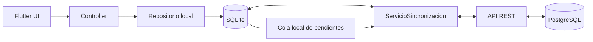

# Arquitectura local-first, módulos y reglas de UI

> Registro histórico: la instalación vigente está en [README](../README.md) y en `database/PostgreSQL/v1/BD_COMPLETA.sql`. Los instaladores y migraciones anteriores se conservan en Git; no seguir sus instrucciones como instalación actual.

## Decisión y alcance actual

SQLite será la fuente inmediata de información persistente de negocio para Flutter. La API mantiene la copia local sincronizada con PostgreSQL; una respuesta remota no alimenta directamente una vista de negocio. La autenticación es la excepción autorizada: el login existente requiere validación online y conserva sesión/JWT únicamente en memoria.

Esta etapa implementa infraestructura real SQLite y cola técnica, reorganiza Login/Home y añade conectividad e indicador global. No implementa Tickets, tablas de negocio, endpoints nuevos, envío/descarga de negocio, fotografías, persistencia JWT o autenticación offline. API, PostgreSQL y documentos database/ no se modificaron.



Las flechas de sincronización representan el flujo previsto: su base actual consulta pendientes y puede comprobar el health existente manualmente; no envía ni descarga recursos de negocio.

## Estructura de mobile/lib

```text
lib/
  main.dart
  app/
    bindings/dependencias_app.dart
    constants/textos_app.dart
    database/
      configuracion_sqlite.dart
      conexion_sqlite.dart
      esquema_sqlite.dart
      operaciones_sqlite.dart
      resultado_sqlite.dart
      estado_sincronizacion.dart
      operacion_pendiente.dart
      repositorio_cola.dart
    network/                      # canal HTTP existente
    routes/                       # rutas GetX existentes
    services/
      servicio_sesion.dart
      servicio_conectividad.dart
      servicio_sincronizacion.dart
    theme/
  models/                         # Usuario, SesionUsuario, ResultadoAutenticacion
  modules/
    login/
      main_login.dart              # VistaLogin
      controlador_login.dart
      servicio_autenticacion.dart
      widgets_login/
        cabecera_login.dart
        formulario_login.dart
    home/
      main_home.dart               # VistaInicio
      controlador_inicio.dart
      widgets_home/
        cabecera_inicio.dart
        contenido_inicio.dart
  widgets/
    apartada/indicador_desconexion.dart
```

Los archivos main_login/main_home cumplen la función conceptual de MainLogin/MainHome y conservan las clases españolas VistaLogin/VistaInicio. Las antiguas carpetas de controllers/services/views ya no contienen código activo. No se crea un módulo Tickets.

## Módulos y presentación

Cada widget propio relevante tiene clase y archivo individual. No se fragmentan Text, Padding o SizedBox en clases artificiales. Login/Home componen cabecera y contenido; sus widgets internos no se importan entre módulos. La comunicación usa rutas y servicios globales; los modelos compartidos permanecen en models/.

Las vistas/widgets solo componen, muestran estado y enlazan eventos a controllers. No realizan HTTP/SQLite, transforman JSON, construyen payloads, sincronizan ni deciden reglas de negocio. FormularioLogin conserva contraseña oculta, estados de carga/error y eventos hacia ControladorLogin. ContenidoInicio muestra identidad pública y llama cerrarSesion. La validación, navegación y ciclo de vida de campos siguen en controllers.

ServicioAutenticacion pertenece a login; ServicioSesion es global y permanece en memoria. DependenciasApp conserva IConexionApi y registra la infraestructura local de forma diferida: la base se crea al realizar la primera operación, no al construir una vista. GetX recrea controllers por ruta y los campos se liberan en onClose. Los nombres /login y /inicio y los contratos HTTP permanecen iguales.

IndicadorDesconexion vive en widgets/apartada/, consume ServicioConectividad mediante GetView/Obx y muestra un icono de 20 puntos en la esquina superior derecha de Login/Home solo si se confirmó ausencia de red. Con red o estado desconocido se oculta. No contiene detección ni HTTP y reutiliza TextosApp/ColoresApp.

## SQLite y operaciones

ConexionSqlite centraliza apertura y cierre mediante sqflite. Comparte la apertura entre llamadas concurrentes, permite reintentar una apertura fallida y recibe fábrica/ruta alternativas para tests. El archivo privado es incidencias_tecnicas.db y la versión es 1, definidos solo en ConfiguracionSqlite. El esquema técnico vive en EsquemaSqlite.

Se crea la base únicamente al necesitarla. Las actualizaciones futuras deben incrementar versión e implementar migraciones incrementales en onUpgrade. No se borra/recrea la BD ante cambios y se rechazan migraciones desconocidas o downgrades destructivos. El cierre explícito se usa al terminar consumidores y se integra con onClose del servicio global.

OperacionesSqlite ejecuta seleccionar, insertar, actualizar y eliminar usando helpers y argumentos enlazados de sqflite. Tablas, campos y mapeos son responsabilidad de repositorios. Los identificadores/condiciones provienen de código confiable; los valores del usuario deben ir en argumentos. ResultadoSqlite<T> devuelve datos o un error público genérico sin SQL, payload o exceptions técnicas.

transaccion entrega una instancia ligada al Transaction del paquete. El repositorio debe utilizar esa instancia y OperacionesSqlite.exigir para abortar si falla cualquier operación. Así, una escritura de negocio futura y su entrada en RepositorioCola se confirmarán juntas o se revertirán juntas. No se usa la conexión principal dentro del callback transaccional. No se implementa un ORM propio.

## Cola transversal

La única tabla actual es cola_sincronizacion:

| Campo | Representación y finalidad |
|---|---|
| id | INTEGER PRIMARY KEY AUTOINCREMENT, identificador local |
| recurso | TEXT, módulo/recurso definido por el repositorio futuro |
| operacion | TEXT, TipoOperacionLocal: crear/actualizar/eliminar |
| payload | TEXT, objeto JSON de negocio |
| creado_en | TEXT, fecha ISO 8601 UTC |
| estado | TEXT restringido al enum EstadoSincronizacion |
| intentos | INTEGER no negativo, incrementado al reclamar un envío |
| ultimo_error | TEXT nullable, código controlado red/servidor/respuesta |

EstadoSincronizacion centraliza pendiente, procesando, sincronizado y error. Estos nombres son valores persistidos; cambiarlos requiere migración. OperacionPendiente reconstruye el JSON/fecha/enums fuera de UI.

RepositorioCola permite agregarPendiente, obtenerPendientes, marcarProcesando, marcarSincronizado, marcarError y devolverPendiente. La lectura devuelve pendientes y errores reintentables ordenados por id; excluye procesando/sincronizado. Reclamar incrementa intentos en una transacción. Solo una operación procesando puede confirmarse, fallar o volver a pendiente. Al fallar red se conserva payload y registro; no se confirma éxito sin respuesta. La fila sincronizada se conserva: no hay política de limpieza todavía.

El payload se serializa con jsonEncode antes de escribir. La cola rechaza campos sensibles anidados, valores Bearer/JWT reconocibles y objetos no serializables. ultimo_error solo admite un enum, no cuerpos API o mensajes libres. No guarda password, PasswordHash, ConnectionString, tokens ni claves. Esta validación es una defensa adicional; cada repositorio de negocio deberá proporcionar un conjunto explícito de campos permitido y no introducir secretos en textos libres. El token se obtendrá desde ServicioSesion al enviar, nunca desde SQLite.

## Conectividad y sincronización

ServicioConectividad escucha eventos de connectivity_plus, consulta inicialmente y refresca al reanudar Android. Cancela suscripción/observador al cerrar; una respuesta inicial tardía no pisa un evento reciente. Expone redDisponible nullable: true con algún transporte, false sin transportes y null cuando aún no se conoce o falla la detección.

Detectar Wi-Fi/datos móviles no garantiza Internet ni API. La clase no consulta health. ServicioSincronizacion depende de conectividad, IConexionApi, RepositorioCola y ServicioSesion. consultarPendientes lee únicamente SQLite; puedeIntentarEnvio expresa condiciones locales mínimas de sesión/red y no inicia envíos. comprobarDisponibilidadApi consulta el endpoint health existente solo por llamada explícita y guarda el resultado de esa comprobación, sin JWT, polling, background workers ni consumo de datos remotos por la UI.

Flujo futuro offline: Controller → repositorio → transacción (negocio + cola) → lectura SQLite → UI inmediata, sin esperar obligatoriamente al servidor. Flujo futuro online: el mismo guardado local, seguido de un intento de envío; confirmar en API actualiza estado local. Descargar: API → ServicioSincronizacion → transformación → repositorio → SQLite → refresco/lectura del controller → vista. La respuesta descargada no se representa directamente en UI.

Actualmente solo se puede guardar/probar la cola técnica. No se puede consultar o editar Tickets offline porque aún no existe ese módulo. No hay reintentos automáticos al reconectar ni rutas de envío de negocio.

## Límites y decisiones posteriores

- La política de conflictos se definirá al editar Tickets. No hay sobrescritura automática de cambios locales pendientes.
- Antes de enviar cambios reales deben definirse identidad/propiedad de la cola al cambiar de usuario, contratos por recurso e idempotencia. Hoy no se producen ni envían cambios de negocio de usuarios.
- Recuperar operaciones procesando tras una interrupción y limpiar filas sincronizadas quedan para la etapa de envío; actualmente nadie reclama envíos automáticamente.
- No se decide autenticación offline ni persistencia JWT en esta etapa.

## Dependencias y fuentes

sqflite 2.4.2+1 y path 1.9.1 son dependencias de ejecución para SQLite y rutas. connectivity_plus 6.1.5 conserva compatibilidad con el Gradle actual sin modificarlo. sqflite_common_ffi 2.3.7+1 es solo de desarrollo para SQLite real en tests del equipo; su restricción evita añadir hooks nativos de sqlite3 v3. No se importa FFI en lib/ ni se habilita SQLite Windows para la app.

Referencias de los autores: [sqflite](https://pub.dev/packages/sqflite), [connectivity_plus 6.1.5](https://pub.dev/packages/connectivity_plus/versions/6.1.5), [sqflite_common_ffi](https://pub.dev/packages/sqflite_common_ffi) y [path](https://pub.dev/packages/path).

## Validación y problemas encontrados

- flutter analyze --no-pub: sin incidencias.
- flutter test --no-pub: 36 aprobadas y 2 reales opt-in omitidas por defecto. Las normales no dependen de PostgreSQL.
- SQLite real/FFI: apertura concurrente, versión, CRUD parametrizado, cola, estados/intentos, fallo de red, rechazo de secretos, rollback y conservación al cerrar/reabrir archivo.
- Conectividad: cambios, estado desconocido, respuesta tardía, reanudación y cancelación de eventos.
- Módulos/UI: Login/Home, indicador online/offline, composición e historial/logout. Las pruebas previas de autenticación/carga/errores siguen aprobadas.
- Base de sincronización: health manual sin JWT, red sin API, bloqueo offline y lectura de pendientes sin modificar cola.
- Prueba opt-in Flutter → API → PostgreSQL: login y /me aprobados con credenciales externas de DATOS_PRUEBA.md.
- flutter build apk --debug --no-pub con API_BASE_URL para USB: APK generado sin credenciales de prueba.
- dotnet build: 0 errores y 0 advertencias después de reiniciar la instancia que bloqueaba el ejecutable.
- Health, Swagger, login y /me: HTTP 200 después del refactor. API y PostgreSQL sin modificaciones.

Se agregó integration_test/sqlite_real_test.dart para comprobar sqflite nativo en una base efímera Android sin modificar datos de usuario. Su ejecución adicional física requiere que el teléfono esté conectado; al intentar ejecutarla Flutter no encontró el dispositivo. No se usaron emuladores.

Flutter advirtió que Windows requiere Developer Mode para enlaces de plugins de escritorio. Se resolvieron las dependencias y se completaron las validaciones Android/tests con --no-pub sin modificar ajustes del sistema. Se corrigieron detalles menores de const/análisis durante desarrollo. Documentación del código: revisada mediante /// en español; no se comenta código generado.

La revisión de secrets, commits lógicos, push y estado local/remoto se comprueban antes de cerrar esta etapa. Sus resultados exactos se informan en el reporte final.
